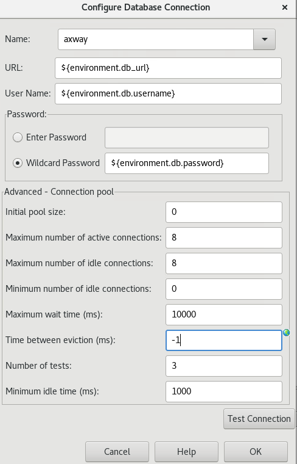
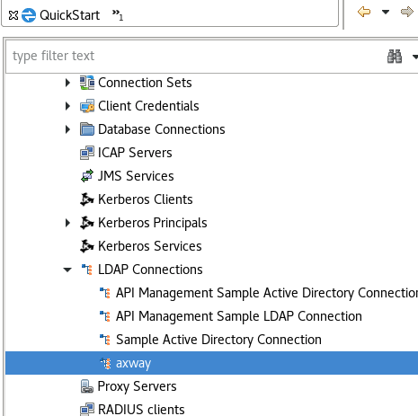
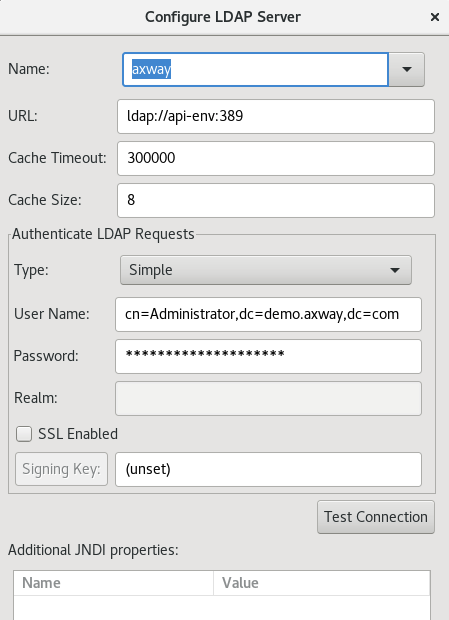
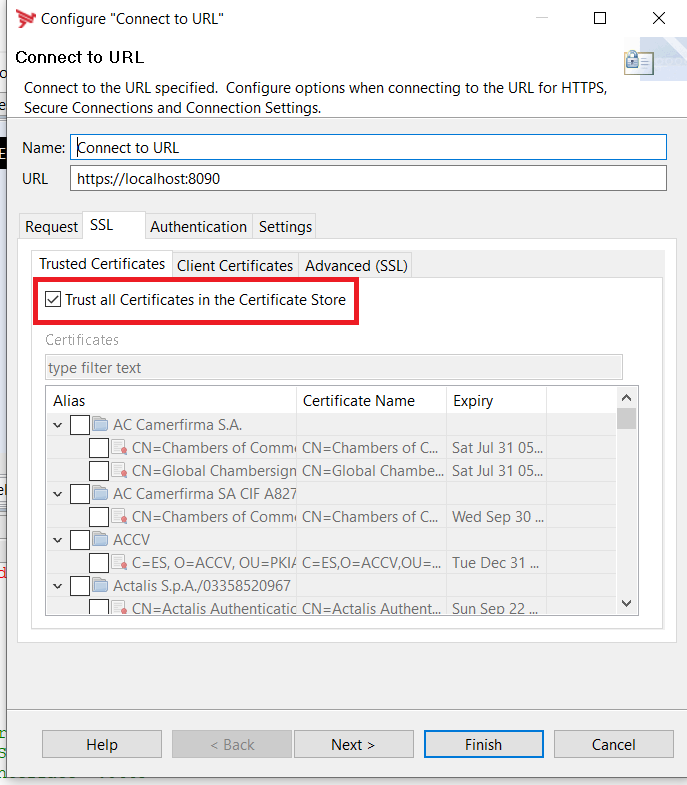
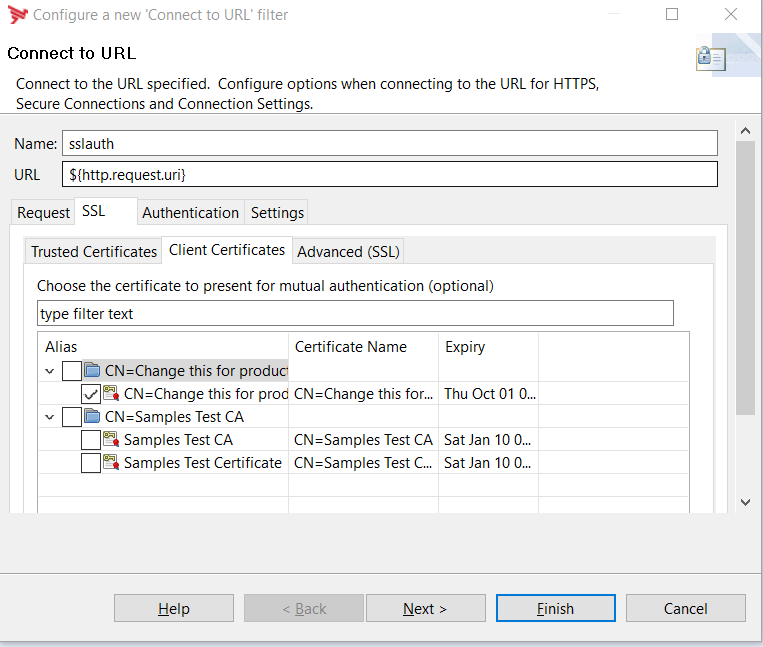
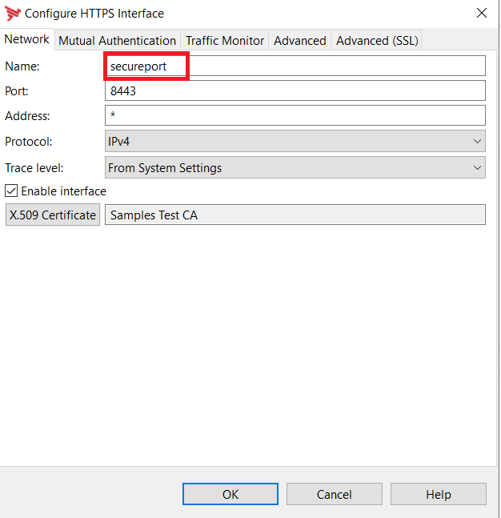

# APIM Environmentalization

Axway APIM supports environmentalization through Configuration Studio and envSettings.props file, it does partially support environment variables.

Main objective of the project is to support environmentalization for EMT ( externally managed topology ) to reuse the container in upstream environments ( QA, Production, etc..).  The same approach could be used for classic deployment as well.

List of supported environment listed in EMT ( externally managed topology ) - [APIM Runtime Parameters](https://docs.axway.com/bundle/axway-open-docs/page/docs/apim_installation/apigw_containers/container_env_variables/index.html)

Environment variables should be prefixed with **environment** for  APIM to reference enivironment variable. The **environment** prefix could be used in most of the filters and connections, [ Refer  database connection environment prefix Usage](#database-environmentalization-example-with-environment-prefix).

## Advantages of using environment variables

- Securly store credentilas (password and certificate) using Kubernetes secrets.
- Adhere to The Twelve-Factor App rule **Store config in the environment** - https://12factor.net/config


## Database Environmentalization example with **environment** prefix.
- Database connection URL is environmentalized with environment variable db_url ( **environment** prefix should be used to reference environment variable)



- Database password should use the option Wildcard Password for environmentalization

#### Environmentalization Classic APIM  example
**Remove "environment" prefix when referening environment variable**

```bash
$export db.password=changeme
$export db.username=root
$export db_url=jdbc:mysql://mysql:3306/Axway
```

#### Environmentalization Container Example
```yaml
## Kubernetes manifest  
env:  
      
        - name: db_url
          value: jdbc:mysql://mysql:3306/Axway
        - name: db.username
          value: root
        - name: db.password
          value: changeme


## docker-compose.yaml
environment:
      EMT_ANM_HOSTS: nodemgr:8090
      db_url: jdbc:mysql://mysql:3306/Axway
      db.username: root
      db.password: changme
     
```

## Following fields  does not support **environment** prefix which are handled by this project.

|environment variable Name | Filter / Connection  Name | Description|
--- | --- | ---
|ldap_connectionname_password|Configure LDAP Server|Enables environmentalization of **Password** field **connectionname** - Name used in Configure LDAP server and it should not contain blank spaces [Refer](#example)|
|ldap_connectionname_username|Configure LDAP Server|Enables environmentalization of **Username** field [Refer](#example)|
|ldap_connectionname_url|Configure LDAP Server|Enable environmentalization of **Provider URL** field [Refer](#example)|
|jms_servicename_password|JMS Service|Enables environmentalization of **Password** field|
|jms_servicename_username|JMS Service|Enables environmentalization of **Username** field|
|jms_servicename_url|JMS Service|Enables environmentalization of **Provider URL** field|
|smtp_manager_password|SMTP Server|Enables environmentalization of API manager SMTP and Alert Email **Password** field|
|smtp_manager_username|SMTP Server|Enables environmentalization of API manager SMTP and Alert Email **Username** field|
|smtp_manager_url|SMTP Server|Enables environmentalization of API manager SMTP and Alert Email **SMTP Server Hostname** field|
|smtp_manager_port|SMTP Server|Enables environmentalization of API manager SMTP and Alert Email **SMTP Server Port** field|
|smtp_manager_connectionType|SMTP Server|Enables environmentalization of API manager SMTP and Alert Email **SMTP Connection Connection Security** field, possible values **NONE, SSL, TLS**, default value **NONE** |
|smtp_servername_password|SMTP Server|Enables environmentalization of **Password** field|
|smtp_servername_username|SMTP Server|Enables environmentalization of **Username** field|
|smtp_servername_url|SMTP Server|Enables environmentalization of **SMTP Server Hostname** field|
|smtp_servername_port|SMTP Server|Enables environmentalization of **SMTP Server Port** field|
|smtp_servername_connectionType|SMTP Server|Enables environmentalization of **SMTP Server Connection Security** field, possible values **NONE, SSL, TLS**, default value **NONE** |
|httpbasic_profilename_password|Client Authentication - Http Basic|Enables environmentalization of **Password** field|
|disablehttps_portname|Client Authentication - Http Basic|Disables HTTPS Listener Interface, possible values true and false|
|disablehttp_portname|Client Authentication - Http Basic|Disables HTTP Listener Interface, possible values true and false|
|cassandra_password|Cassandra Connection|Cassandra server password|
|cassandra_disablessl|Cassandra Connection|Disables Cassandra SSL connection, possible values true and false [Refer](#cassandra)|
|cassandraconsistency_readlevel| Cassandra Read Consistency level | Updates cassandra read consistency level of KPS, Quota, Throttling and Oauth2 Store, Possible consistency level are **ONE, TWO, THREE, QUORUM, LOCAL_QUORUM, LOCAL_ONE and ALL** [Refer](#cassandra)|
|cassandraconsistency_writelevel| Cassandra Write Consistency level | Updates cassandra write consistency level of KPS, Quota, Throttling and Oauth2 Store, Possible consistency level are **ONE, TWO, THREE, QUORUM, LOCAL_QUORUM, LOCAL_ONE and ALL** [Refer](#cassandra)|
|cassandraCert_root| Cassandra Connection | Enables environmentalization of certificate based authentication [Refer](#cassandra)|
|cert_name| Connect to URL | Enables environmentalization of One way SSL authentication **name** refers to an alias / unique name of certificate [Refer](#connect-to-url)|
|jwtverifycert_name| JWT Verify | Enables environmentalization of certificate to verify JWT signature |


## Connect to URL Client Authentication  with p12 file

|environment variable Name | Filter / Connection  Name | Description|
--- | --- | ---
|connecttourl_certandkey_name|Connect to URL| Enables environmentalization of Mutual Authentication "name" refers to connect to url filter name [Refer](#connect-to-url),  p12 file path or base64 encoded content |
|connecttourlcertandkeypassword_name|Connect to URL| Password of p12 file used in connect to url filter [Refer](#connect-to-url) |

## Connect to URL Client Authentication  with pem file

|environment variable Name | Filter / Connection  Name | Description|
--- | --- | ---
|connecttourlcert_name|Connect to URL| Public certificate path or base64 encoded content |
|connecttourlkey_name|Connect to URL| Private key of the certificate path or base64 encoded content  |
|connecttourlcacert_name|Connect to URL| CA certificate path or baseb4 encoded content |

### Example

```
#backend - Name of connect to url filter
   export connecttourlcert_backend = /opt/Axway/apigateway/ext/conf/acp-crt.pem
   export connecttourlkey_backend: /opt/Axway/apigateway/ext/conf/acp-key.pem
   export connecttourlcacert_backend: /opt/Axway/apigateway/ext/conf/acp-ca.pem
```
## Configure HTTPS Listener Certificate and trust certificate for Mutual Auth with p12 file

|environment variable Name | Filter / Connection  Name | Description|
--- | --- | ---
|certandkey_httpsportname| HTTPS Listener | Enables environmentalization of https listener certificate [Refer](#https-listener),  p12 file path or base64 encoded content |
|certandkeypassword_httpsportname| HTTPS Listener | Password of p12 file used in Listener port [Refer](#https-listener) |
|certandkeymtls_httpsportname| HTTPS Listener | Trust CA certificate / certificate provided in p12 file, possible values true, default false |


## Configure HTTPS Listener Certificate and trust certificate for Mutual Auth with pem file

|environment variable Name | Filter / Connection  Name | Description|
--- | --- | ---
|listenercert_httpsportname| HTTPS Listener | Public certificate path or base64 encoded content |
|listenerkey_httpsportname| HTTPS Listener | Private key of the certificate path or base64 encoded content |
|listenercacert_httpsportname| HTTPS Listener |  CA certificate path or baseb4 encoded content |
|listenermtls_httpsportname| HTTPS Listener |  Trust CA certificate / certificate provided in p12 file, possible values true, default false |


## JWT Sign Client Authentication  with pem file

|environment variable Name | Filter / Connection  Name | Description|
--- | --- | ---
|jwtsigncert_name|JWT Sign| Public certificate path or base64 encoded content |
|jwtsignkey_name|JWT Sign| Private key of the certificate path or base64 encoded content  |
|jwtsigncacert_name|JWT Sign| CA certificate path or baseb4 encoded content |
|jwtsignkid_name|JWT Sign| Kid corresponding to certificate set as alias name in JWT Sign filter |

### Example

LDAP Connections, JMS, SMTP does not support environment variables.

For example  LDAP environment variable follows a format **ldap_axway_username**

- Prefix "ldap" refers to LDAP connection  - the prefix used by LoadableModule to update the appropriate entity in entity store.
- Next field "axway" refers to  LDAP connection in Policystudio.
- Suffix "username" is a username of axway ldap connection.







- LDAP Environment Variable

```bash
$export ldap_axway_username=cn=Administrator,dc=axwaydemo,dc=com
$export ldap_axway_password=xyz1234abc
$export ldap_axway_url=ldap://localhost:389
```
- JMS Environment Variable
```bash
$export jms_axway_username=axway
$export jms_axway_password=axway
$export jms_axway_url=ssl://b-871f83a2-9d81-47ce-af1e-8fdc23775442-1.mq.us-east-2.amazonaws.com:61617
```
- SMTP Server API manager Environment variable - updates SMTP server and alert configurations
```bash
$export smtp_manager_username=rnatarajan
$export smtp_manager_password=changeme
$export smtp_manager_url=smtp.axway.com
$export smtp_manager_port=587
$export smtp_manager_connectionType=TLS
```
- SMTP Server Environment variable - updates SMTP server and alert configurations
```bash
$export smtp_smtpserver_username=rnatarajan
$export smtp_smtpserver_password=changeme
$export smtp_smtpserver_url=smtp.axway.com
```

- HTTP Basic
```bash
$export httpbasic_backend=changme
```

- Disable HTTPS Interfaces

```bash
##replace 'portname' with your HTTPS Port Name

$export disablehttps_portname=true
```

- Disable HTTP Interfaces

```bash
##replace 'portname' with your HTTP Port Name

$export disablehttp_portname=true
```

- Radius
```bash
```
### Cassandra

- Disable Cassandra SSL
```bash
$export cassandra_disablessl=true
```

- Setup Cassandra read and write Consistency level

```bash
$export cassandraconsistency_readlevel=QUORUM
$export cassandraconsistency_writelevel=QUORUM
```

Possible consistency level values are **ONE, TWO, THREE, QUORUM, LOCAL_QUORUM, LOCAL_ONE and ALL**


- Cassandra Certificate reference
```bash
$export cassandraCert_root="-----BEGIN CERTIFICATE-----
MIICxDCCAaygAwIBAgIGAW5HwjW7MA0GCSqGSIb3DQEBCwUAMBExDzANBgNVBAMM
BkRvbWFpbjAgFw0xOTEwMzEyMTI1NDBaGA8yMTE5MTAxNDIxMjU0MFowETEPMA0G
A1UEAwwGRG9tYWluMIIBIjANBgkqhkiG9w0BAQEFAAOCAQ8AMIIBCgKCAQEAlX2n
ePJaDMGWpNUwgyCfyDVIMjLKRjvJ7bID+BF+LI9gxJ2mUVFXl822fT3m2BR5oG8s
N/8JgvM+ie2PHxAWYokQcRSwYAFmMMMKp69M8sqAJHrm/QoVvFwCFVm+7DqJVKWu
q5K+J+ophJQNhvSl0KLorFI8IodLZq5cDtyhfaB27Zbk1A9ha4PfXmnoFWbDwoZU
UanoUy3xisbZ6HTvGKkawn53XaRJo5rn13b/9Np8PCJZLNmAiWoIB3NVyetwxS5C
4FwIm2ZRJZny5l+CgJ9Frs9Y0teAz4Z1bqJWn+kfBCxGW8Ab7W7t6ah3a/WoQxi2
HDU/134lBvoPhh9udwIDAQABoyAwHjAPBgNVHRMECDAGAQH/AgEAMAsGA1UdDwQE
AwICvDANBgkqhkiG9w0BAQsFAAOCAQEAlEo5pn1j8spkVg3RbLap80iwo8Slk+Fw
v8tGqR+GJEiJXDgnPPDMkrE+wtC1kT4VxyQw8D0eittUPjFmoMdxoUwM5Ddf4qS7
3LBO74CULyFZ0teyJoaVBjaG6MTg0ZfwUZt552IVLBgjbbE/yYu/dOJckpZlcZE7
yRw3ffr/trqh2B5tzwJMnWsakRwAtooRJ2RZ8ufQUhEYdI/7KJajZDQ0IFxleyPZ
PLHu3INlHcXQs3AY0wNBLhL2jBwZ0uwBYK+entFpCgb+Z+RQ+uxs3joYuKEMj6M6
6Xi8yAoGAN92VRi93iss3A7zoAsrPXCO7pNZdz3QzJ3Jjv9KW48DmQ==
-----END CERTIFICATE-----" 
## Use file path - file should be created via config map / mount
$export cassandraCert_root = /opt/Axway/apigateway/certs/cassandra.pem
```


### Connect to URL

- Connect to URL One way SSL  - to trust the backend root and intermediate certificates. In order to use the feature, connect to URL filter should be enabled with "trust all Certificates in the certificate store"



```bash
$export cert_domainroot="-----BEGIN CERTIFICATE-----
MIICxDCCAaygAwIBAgIGAW5HwjW7MA0GCSqGSIb3DQEBCwUAMBExDzANBgNVBAMM
BkRvbWFpbjAgFw0xOTEwMzEyMTI1NDBaGA8yMTE5MTAxNDIxMjU0MFowETEPMA0G
A1UEAwwGRG9tYWluMIIBIjANBgkqhkiG9w0BAQEFAAOCAQ8AMIIBCgKCAQEAlX2n
ePJaDMGWpNUwgyCfyDVIMjLKRjvJ7bID+BF+LI9gxJ2mUVFXl822fT3m2BR5oG8s
N/8JgvM+ie2PHxAWYokQcRSwYAFmMMMKp69M8sqAJHrm/QoVvFwCFVm+7DqJVKWu
q5K+J+ophJQNhvSl0KLorFI8IodLZq5cDtyhfaB27Zbk1A9ha4PfXmnoFWbDwoZU
UanoUy3xisbZ6HTvGKkawn53XaRJo5rn13b/9Np8PCJZLNmAiWoIB3NVyetwxS5C
4FwIm2ZRJZny5l+CgJ9Frs9Y0teAz4Z1bqJWn+kfBCxGW8Ab7W7t6ah3a/WoQxi2
HDU/134lBvoPhh9udwIDAQABoyAwHjAPBgNVHRMECDAGAQH/AgEAMAsGA1UdDwQE
AwICvDANBgkqhkiG9w0BAQsFAAOCAQEAlEo5pn1j8spkVg3RbLap80iwo8Slk+Fw
v8tGqR+GJEiJXDgnPPDMkrE+wtC1kT4VxyQw8D0eittUPjFmoMdxoUwM5Ddf4qS7
3LBO74CULyFZ0teyJoaVBjaG6MTg0ZfwUZt552IVLBgjbbE/yYu/dOJckpZlcZE7
yRw3ffr/trqh2B5tzwJMnWsakRwAtooRJ2RZ8ufQUhEYdI/7KJajZDQ0IFxleyPZ
PLHu3INlHcXQs3AY0wNBLhL2jBwZ0uwBYK+entFpCgb+Z+RQ+uxs3joYuKEMj6M6
6Xi8yAoGAN92VRi93iss3A7zoAsrPXCO7pNZdz3QzJ3Jjv9KW48DmQ==
-----END CERTIFICATE-----"
```
Classic Example
```bash
$export cert_domain=`cat cert.pem`
## Use file path - file should be created via config map / mount
$export cert_domain = /opt/Axway/apigateway/certs/cert.pem
```


Container Example
```yaml
env:
        - name: cert_domain
          value: "-----BEGIN CERTIFICATE-----
MIIDRjCCAi6gAwIBAgIGAW5HwjW8MA0GCSqGSIb3DQEBCwUAMBExDzANBgNVBAMM
BkRvbWFpbjAgFw0xOTEwMzEyMTI1NDFaGA8yMTE5MTAxNDIxMjU0MVowQjEWMBQG
CgmSJomT8ixkARkWBmhvc3QtMTEQMA4GA1UECwwHZ3JvdXAtMTEWMBQGA1UEAwwN
bm9kZW1hbmFnZXItMTCCASIwDQYJKoZIhvcNAQEBBQADggEPADCCAQoCggEBAL8V
Oqt5OKndTAlSHY1/LATaAdvUUPRrRvyh/BfBGWueQKoG2AQAUA5dN1B1MvPzPaaL
FFYgfrckdmG47MFwkpyFgchl7IVkMhvJYy0Ku+aCoT0Gou9dkEKr9A5W9ZHzuWQM
YRCSfIZqRednP9qFRTma185+jj7EaGiPuglkk8nplNeCbxhMBfGPewEuTBDPIOMw
Ep7ChaRd07/mwmfKCjwh2C910wOg1qH+MEC+yjC3BwaNINAZtHd0lzJRji8Fjtrc
DzTVZf0MF3E8QhW0x1kS/53BQCm6YMxjxUEgorDWrzrmyyanlICsBIASMtMWQQug
P6qfEvj8WLH9VcGSQlMCAwEAAaNxMG8wCQYDVR0TBAIwADALBgNVHQ8EBAMCA7gw
OwYDVR0lBDQwMgYIKwYBBQUHAwEGCCsGAQUFBwMCBg0rBgEEAYGMTgoBAQIBBg0r
BgEEAYGMTgoBAQICMBgGA1UdEQQRMA+CB2FwaS1lbnaHBAqBPDkwDQYJKoZIhvcN
AQELBQADggEBAFfGAtf5Rdn3EkPTsT5CcUo2+kgT3Er9y3D+SeyraM3UcwqR0+gb
JHeLD6xnnkxbDIEr8ZvTL5BNqZad7Iu3mS7QVK7cBi9nHmr7HSzapD6ODli8whtn
daElSKsO9EPAB04rVLIFZ5NIfWHLTDJSyFdvC5JFPuYxWluQwN+KOFJMjs7zVGvm
MXO6WwSd0Q4+NlqgnvRl6viuo14M6Qu9TsidkZhdE+AIRPveYZm9J0FzanYOAoDf
ZGIu5manaCW4XJKyZU/Kp04JR6ojQai65R/OLaFOxQhdZ9rtIN1DAsyTBp/6tqqC
s2+QnHEKNi5n6eyF81l1X3AGOMp2uUF4CfU=
-----END CERTIFICATE-----"
```

- Connect to URL  2-Way SSL / Mutual SSL Authentication

To update Connect to URL  SSL certificate, there are two environment variables used to set up certificate for SSL Authentication

-- connecttourl_certandkey_sslauth

-- connecttourlcertandkeypassword_sslauth

```bash
$export connecttourl_certandkey_sslauth="MIIL5gIBAzCCC7AGCSqGSIb3DQEHAaCCC6EEggudMIILmTCCBi8GCSqGSIb3DQEHBqCCBiAwggYcAgEAMIIGFQYJKoZIhvcNAQcBMBwGCiqGSIb3DQEMAQYwDgQI9bSw5/Kr0SsCAggAgIIF6DTG3vfPtoc4NPgJE9FU43PRyMpBcv/JIefNDTvC5CNQ+7b47Afqo6mJFIndSxTEbHcnWNG/ufC2/C+7oTn8aZyrgi868fgysv9knhOe+tPJ1O6RyF690m00CmoRhE4kCDKMPaAeRR2ZAMAqj9nPrxjWMXKdrS8+LeEhq2SYSozP8VR+llaTrDPtO8+mC9KRfJIgrKpbB0G/qdnJNtrhJJ8fhaE+/Ufkhydwe0tldu+kOGMODCWVpCY5q2MRrQlhvQhLOYJ7LA/Ovz1ZDjOAE9oujqvhegDxwHj4I6sxHYhGsPUYstNiiqpI5ZcODxUajd5JmEGytk9LU/9PtKEQrXMB4/H7RsRV2bVMWtDaHVW5g0h0oUTw5SBJuPEZMljfLSIXiazerlDC5wybVKVoImDcSiYqHzEKj4DivSclrNfFk4JMMaKIphZZ2qBkCEZ0hEyGxwixyE09yexzW6/5Aq/LF51NJ8THjVHFFScDyOdNsAjiNugXFKe9OkuXW130bbLO+iGscWeJ6vGzjQRM9XIcAOiGJf0jwrGmTu+lFu70C4w+ka5oe6smcABsi52NbeZ7ylW74Fd+fU/O18nXoa7kTbzW5V/BaN+r5flxh1Xd2tUfvG00ABcWtDfHGXSuAtPp+LKRvgU0zS9BVMEr/ZpBpT3KbZAfGjk7Ies/ICpu1OKIDmLrrXHS6ZFhr7+frSjUrmrqGW4+eRBpLQDWD1/XNVzRkbfyE6Lv/lMBjc5BAEG3ZVRSpg9FemyYe5mVk1ehOMdQvUqEGd7DkmfMyXgpUVAbOqebhkS2PSRfcwZZ8O+LQOAnrWI4PRsO0XhmKpmith7S4F+IZ+xKVtkDJbNjAW63OVXKK1E914n7DuI07YCn3CGC4V4i3QlGUgY6kHoEIEfYroCGwupkSh2VLdtsru0dhoP8Dzo0AteWt7knjSQ+era/aPy3qSDE6uUbFNEHD+ol7iD5JMPGG1vnmlCu3nedwkH66LI4Zh8JSQ8qfNwSPt6GVScmpu6HmyuEH1gx6C98bvdzQMcsE+VmjldgGOIobIsTFFmcQMHEM/12R5A/VtnVEQHUY6giuFJpA7IZ2fKHtUiH0ijq1gntkUwWiJml/rb9DQHeZloKpYTEs7GuFdi8CNBZ/vThUcFPVlu8XslPm1zQZlXLb4/ian2Mdu78/FIWz7VVVSpJOablgltcIzOR2QdVYv/rmJsqecAnn2g1f+c5RvLMv2XfyJUzyfW/krlwswDiySV788BsSDylAAthUzs0RjOSIkRnaBGhYEEwhgcHOZV3l5xBjbde+0mR2hiZ3XdfQN9ZITHeCrkSv6yTtH3zh4X6YiPnY0BptOvAV/Vk/Ktdio5rSg8zjC8EDGun1p8vt/eYiIu6YEmeLxwrH27SJSgpnRkpN+u23Mq0zRrQevc7VEej0q1l4XrTDJcCTJhr5swT1UUnJ57tnKnz5X3rqrq9UrTzohVFR445PJFxHbrzyAq9og4OOU3Ya4NHcJmm0+st/V2kBs65oAGNItDJGBGyObXSKMJb4yFc6lf7EneHRMDnLTlz8XES/AN1KVih3TMfjUfgfcXFVLWKRoPVuQP0uNIPto9AIasnrxIc2zhcFpebbnUIAVRUBvNfbkHOGnjYTPf1iXs1uyDRmnQxWXbFpsBQ77wGkXrEHACbCg6pBoe9Lw2A0N5LWQniZy5dire24ZczJRKnk1W6T5W7khIqQ0h1leHsDS+bRSjaKt7MmPbp50MhoK/pX7M0Y2oO7p7Y3lQDtJ2VblMtwe7xWDbHMXDtpKQmcJg1rb5Q/2RZ3VUm08sEH3thughjogoXqCXOXn/FaJ7lVGA3qdjGgaZi1JLXd8NozwEcuNvSy/517a4Ek/uRXKVzV8WsdW8JZGvyELvlbIrdk5evNLc8W7nG4Q4BGSvEAhdLqLkpfBxgER+SU/ojSTa2wm8r/bKK5q8SVxvxaFYEAhJJyf3BrRNm9PokzDWlRR08teSkL2WKIWVX1Bw0Wo1F78Ee7DCCBWIGCSqGSIb3DQEHAaCCBVMEggVPMIIFSzCCBUcGCyqGSIb3DQEMCgECoIIE7jCCBOowHAYKKoZIhvcNAQwBAzAOBAg6h0uS8i8h6AICCAAEggTIpKit9ZymYjEoIoMkUpAq44lSCclY8qSmRhoaWnDNTQLhy37fxMf0hiJZ2krvBzGhNLQyBB2Yrob9lry0Sv24mkOUjRxCAhpDu03EThSC/cebaKN0+W1g4qR3EG5zLDtljI+7tgDBhE/PWuV12ZgoP3t9+JHCo1/OVv/IPtUuiP+EVk+SKW9x9/u/HKaordRi4WMhEVW8pUdMktRSQjSzupDE+8GV2ykaZ5BSfbk4RsZD2dyl5hW9lLQ9xFV786667MQcsDh4DhObWQZtX/bASw0/XS6L+TdJmxSOyIci/RGg5iyLxx7xcWRP6zfIiwacrYMxnEB7GX1QDiS3AdjeFoua+htX1DlP7Om15w/b8q79dLhMw+eSUn8g/aLp9n0PKs5mxn6rMcCrmOZJQq5y+0u7g6zOarKx08d6w7yDNCnDS7Hu2DqwaxhHyToEFjQtCw3e7ALdyB/QsZ5HpNNJjyoS+OYbAUJFU5i/oPSX3714wU/gwx/ZiVt4yWW808b8T8ksAKWhp4Gce+VipuNIXKKMdKgx7GiFK12ev31x5BHw+zSUXGc5TXXy0Nb51PTlFwF9/RBXEEleIq0914cK9UumJ6EpdfX6ssqwS9ASFhXfidAlhwH2fuw9lanFB8Y8IDnvBYCxxxtWymh7RZyBumBIdopRA8D2X51BuX6XeYVCYP7PJtXObQfLvGkY50SNOmHbCexq77UxezbMQES+mKW8YXLtZlsD1poOSmrkmRy+jvMXrHFAQidsI5Z2hZjo2sMZSPe+NAwM84yLJYoAq6LuDyhtk3WEbQNO+GB/KqFBOY3fcX0lHFdYEIovTBW+BhspdYEPvJJ01uzgG2VhvriqJ3/ETinKmMvgf5UpJDY+DJ6tgqprN3YCtPB9+NR4cmNz/OUoZKARy64UPWJuX6APGPFIAOD0gNgHqYcrpuksprX/YiYsBVOv/ouqJ9MG36EZ2WYG/KsdtCTssfHYAll5WFu1pGVKVtQJE7sN3Y34jSJDF2F2UoxQbg2CmEnM57GK7kcPjiPnCKPj+o+SEnC8BIO1TxoYnMUB87zfuO53qAdLdQkBvg2salAUsBEHmrDyIOGnEXBuAhHSHbSZSnGpD8gbhnOqfHkRu/OT5BVvnJE+w+dfTlh9vB777VbA5aEYSN16HucPkj3BelDU9+1GctZsSNg4fV/rla7RMf0SUZ02rVbX+52UwxUvuaDH+Pe+QvkTy6sc4b9IIXTphXoZWGClWBGOLBpHfMyxzu2IX4jE4M26DIwUZnVd0vkMYh8dZywgjBCoAJji6Oc1QiNzI3hAwO2sRTaVX5pxZApR+JwPY9ZwLyaOpTSbOXOP7rNZNTMCs1OUHgQdrmPPkE5EBjD/VqXOfLks0Nc8fV1zhofKe088UTZ/qCZKQwK40qhjnYLZ2C1rYjgGtiGHMaPznmwuIazZV9pKgVw+TGTWQmnmuWq7XDEzorbxh0ExjG4S45IQUaTG2kZ9GuHMj3Ocpmf/cJhTZl7wro2x+p/opJYqdKbMOaA+8orsU5r9BCv7NZFh278fSo3fpPut9+ZpmSaYDPpDjAuYlpzv1NFTyAz8Q2myFWFHSxh+KnSfhrEtf4euDRgQ/9gZ2IqXUsZ3FXUNtymfMUYwHwYJKoZIhvcNAQkUMRIeEABDAE4APQBhAHgAdwBhAHkwIwYJKoZIhvcNAQkVMRYEFFnwiPQwNks1gKUHDM3ye/ArMTPaMC0wITAJBgUrDgMCGgUABBQMVJgNbDx/sDqV37rk+lgsiaWPhgQIXKMl/uHVEFw"

# Use file path - file should be created via config map / mount
$export connecttourlcertandkey_sslauth = /opt/Axway/apigateway/certs/cert.p12

# Use k8s secret to manage password
$export connecttourlcertandkeypassword_sslauth=changeit
```
**sslauth** is the name of  Connect to URL filter **WARNING**: Do not use blank spaces in Connect to URL filter name.



### Https Listener

- PKCS12 - To update the https listener certificate.  There are two environment variables used to set up certificate on Listener interface

  -- certandkey_secureport

  -- certandkeypassword_secureport

```bash
$export certandkey_secureport="MIIL5gIBAzCCC7AGCSqGSIb3DQEHAaCCC6EEggudMIILmTCCBi8GCSqGSIb3DQEHBqCCBiAwggYcAgEAMIIGFQYJKoZIhvcNAQcBMBwGCiqGSIb3DQEMAQYwDgQI9bSw5/Kr0SsCAggAgIIF6DTG3vfPtoc4NPgJE9FU43PRyMpBcv/JIefNDTvC5CNQ+7b47Afqo6mJFIndSxTEbHcnWNG/ufC2/C+7oTn8aZyrgi868fgysv9knhOe+tPJ1O6RyF690m00CmoRhE4kCDKMPaAeRR2ZAMAqj9nPrxjWMXKdrS8+LeEhq2SYSozP8VR+llaTrDPtO8+mC9KRfJIgrKpbB0G/qdnJNtrhJJ8fhaE+/Ufkhydwe0tldu+kOGMODCWVpCY5q2MRrQlhvQhLOYJ7LA/Ovz1ZDjOAE9oujqvhegDxwHj4I6sxHYhGsPUYstNiiqpI5ZcODxUajd5JmEGytk9LU/9PtKEQrXMB4/H7RsRV2bVMWtDaHVW5g0h0oUTw5SBJuPEZMljfLSIXiazerlDC5wybVKVoImDcSiYqHzEKj4DivSclrNfFk4JMMaKIphZZ2qBkCEZ0hEyGxwixyE09yexzW6/5Aq/LF51NJ8THjVHFFScDyOdNsAjiNugXFKe9OkuXW130bbLO+iGscWeJ6vGzjQRM9XIcAOiGJf0jwrGmTu+lFu70C4w+ka5oe6smcABsi52NbeZ7ylW74Fd+fU/O18nXoa7kTbzW5V/BaN+r5flxh1Xd2tUfvG00ABcWtDfHGXSuAtPp+LKRvgU0zS9BVMEr/ZpBpT3KbZAfGjk7Ies/ICpu1OKIDmLrrXHS6ZFhr7+frSjUrmrqGW4+eRBpLQDWD1/XNVzRkbfyE6Lv/lMBjc5BAEG3ZVRSpg9FemyYe5mVk1ehOMdQvUqEGd7DkmfMyXgpUVAbOqebhkS2PSRfcwZZ8O+LQOAnrWI4PRsO0XhmKpmith7S4F+IZ+xKVtkDJbNjAW63OVXKK1E914n7DuI07YCn3CGC4V4i3QlGUgY6kHoEIEfYroCGwupkSh2VLdtsru0dhoP8Dzo0AteWt7knjSQ+era/aPy3qSDE6uUbFNEHD+ol7iD5JMPGG1vnmlCu3nedwkH66LI4Zh8JSQ8qfNwSPt6GVScmpu6HmyuEH1gx6C98bvdzQMcsE+VmjldgGOIobIsTFFmcQMHEM/12R5A/VtnVEQHUY6giuFJpA7IZ2fKHtUiH0ijq1gntkUwWiJml/rb9DQHeZloKpYTEs7GuFdi8CNBZ/vThUcFPVlu8XslPm1zQZlXLb4/ian2Mdu78/FIWz7VVVSpJOablgltcIzOR2QdVYv/rmJsqecAnn2g1f+c5RvLMv2XfyJUzyfW/krlwswDiySV788BsSDylAAthUzs0RjOSIkRnaBGhYEEwhgcHOZV3l5xBjbde+0mR2hiZ3XdfQN9ZITHeCrkSv6yTtH3zh4X6YiPnY0BptOvAV/Vk/Ktdio5rSg8zjC8EDGun1p8vt/eYiIu6YEmeLxwrH27SJSgpnRkpN+u23Mq0zRrQevc7VEej0q1l4XrTDJcCTJhr5swT1UUnJ57tnKnz5X3rqrq9UrTzohVFR445PJFxHbrzyAq9og4OOU3Ya4NHcJmm0+st/V2kBs65oAGNItDJGBGyObXSKMJb4yFc6lf7EneHRMDnLTlz8XES/AN1KVih3TMfjUfgfcXFVLWKRoPVuQP0uNIPto9AIasnrxIc2zhcFpebbnUIAVRUBvNfbkHOGnjYTPf1iXs1uyDRmnQxWXbFpsBQ77wGkXrEHACbCg6pBoe9Lw2A0N5LWQniZy5dire24ZczJRKnk1W6T5W7khIqQ0h1leHsDS+bRSjaKt7MmPbp50MhoK/pX7M0Y2oO7p7Y3lQDtJ2VblMtwe7xWDbHMXDtpKQmcJg1rb5Q/2RZ3VUm08sEH3thughjogoXqCXOXn/FaJ7lVGA3qdjGgaZi1JLXd8NozwEcuNvSy/517a4Ek/uRXKVzV8WsdW8JZGvyELvlbIrdk5evNLc8W7nG4Q4BGSvEAhdLqLkpfBxgER+SU/ojSTa2wm8r/bKK5q8SVxvxaFYEAhJJyf3BrRNm9PokzDWlRR08teSkL2WKIWVX1Bw0Wo1F78Ee7DCCBWIGCSqGSIb3DQEHAaCCBVMEggVPMIIFSzCCBUcGCyqGSIb3DQEMCgECoIIE7jCCBOowHAYKKoZIhvcNAQwBAzAOBAg6h0uS8i8h6AICCAAEggTIpKit9ZymYjEoIoMkUpAq44lSCclY8qSmRhoaWnDNTQLhy37fxMf0hiJZ2krvBzGhNLQyBB2Yrob9lry0Sv24mkOUjRxCAhpDu03EThSC/cebaKN0+W1g4qR3EG5zLDtljI+7tgDBhE/PWuV12ZgoP3t9+JHCo1/OVv/IPtUuiP+EVk+SKW9x9/u/HKaordRi4WMhEVW8pUdMktRSQjSzupDE+8GV2ykaZ5BSfbk4RsZD2dyl5hW9lLQ9xFV786667MQcsDh4DhObWQZtX/bASw0/XS6L+TdJmxSOyIci/RGg5iyLxx7xcWRP6zfIiwacrYMxnEB7GX1QDiS3AdjeFoua+htX1DlP7Om15w/b8q79dLhMw+eSUn8g/aLp9n0PKs5mxn6rMcCrmOZJQq5y+0u7g6zOarKx08d6w7yDNCnDS7Hu2DqwaxhHyToEFjQtCw3e7ALdyB/QsZ5HpNNJjyoS+OYbAUJFU5i/oPSX3714wU/gwx/ZiVt4yWW808b8T8ksAKWhp4Gce+VipuNIXKKMdKgx7GiFK12ev31x5BHw+zSUXGc5TXXy0Nb51PTlFwF9/RBXEEleIq0914cK9UumJ6EpdfX6ssqwS9ASFhXfidAlhwH2fuw9lanFB8Y8IDnvBYCxxxtWymh7RZyBumBIdopRA8D2X51BuX6XeYVCYP7PJtXObQfLvGkY50SNOmHbCexq77UxezbMQES+mKW8YXLtZlsD1poOSmrkmRy+jvMXrHFAQidsI5Z2hZjo2sMZSPe+NAwM84yLJYoAq6LuDyhtk3WEbQNO+GB/KqFBOY3fcX0lHFdYEIovTBW+BhspdYEPvJJ01uzgG2VhvriqJ3/ETinKmMvgf5UpJDY+DJ6tgqprN3YCtPB9+NR4cmNz/OUoZKARy64UPWJuX6APGPFIAOD0gNgHqYcrpuksprX/YiYsBVOv/ouqJ9MG36EZ2WYG/KsdtCTssfHYAll5WFu1pGVKVtQJE7sN3Y34jSJDF2F2UoxQbg2CmEnM57GK7kcPjiPnCKPj+o+SEnC8BIO1TxoYnMUB87zfuO53qAdLdQkBvg2salAUsBEHmrDyIOGnEXBuAhHSHbSZSnGpD8gbhnOqfHkRu/OT5BVvnJE+w+dfTlh9vB777VbA5aEYSN16HucPkj3BelDU9+1GctZsSNg4fV/rla7RMf0SUZ02rVbX+52UwxUvuaDH+Pe+QvkTy6sc4b9IIXTphXoZWGClWBGOLBpHfMyxzu2IX4jE4M26DIwUZnVd0vkMYh8dZywgjBCoAJji6Oc1QiNzI3hAwO2sRTaVX5pxZApR+JwPY9ZwLyaOpTSbOXOP7rNZNTMCs1OUHgQdrmPPkE5EBjD/VqXOfLks0Nc8fV1zhofKe088UTZ/qCZKQwK40qhjnYLZ2C1rYjgGtiGHMaPznmwuIazZV9pKgVw+TGTWQmnmuWq7XDEzorbxh0ExjG4S45IQUaTG2kZ9GuHMj3Ocpmf/cJhTZl7wro2x+p/opJYqdKbMOaA+8orsU5r9BCv7NZFh278fSo3fpPut9+ZpmSaYDPpDjAuYlpzv1NFTyAz8Q2myFWFHSxh+KnSfhrEtf4euDRgQ/9gZ2IqXUsZ3FXUNtymfMUYwHwYJKoZIhvcNAQkUMRIeEABDAE4APQBhAHgAdwBhAHkwIwYJKoZIhvcNAQkVMRYEFFnwiPQwNks1gKUHDM3ye/ArMTPaMC0wITAJBgUrDgMCGgUABBQMVJgNbDx/sDqV37rk+lgsiaWPhgQIXKMl/uHVEFw"

# Use file path - file should be created via config map / mount
$export certandkey_secureport = /opt/Axway/apigateway/certs/cert.p12

# Use k8s secret to manage password
$export certandkeypassword_secureport=changeit
```
**secureport** is the name of the https interface **WARNING**: Do not use blank spaces.



## Implemenation Details

This project uses **Loadable module** feature to support environmentalization [Refer Java interfaces for extending API Gateway for more information](https://docs.axway.com/bundle/axway-open-docs/page/docs/apigtw_devguide/java_extend_gateway/index.html).


### Build the project


- Create jar file using maven
```bash
$mvn clean package
```

### Add Loadable Module to EMT Container

- Import Loadable Module
  Open Policystudio, Navigate to menu File -> Import -> Import Custom filters, select apim-policy-password-cert-env/src/main/resources/typeSet.xml. It will add Loadable module to entity store.

- Export fed file ( e.g container_env.fed) to build container

- Build a container merge directory ( **--merge-dir** ) option

  - The merge directory must be called apigateway and must have the same directory structure as in an API Gateway installation.
  - Copy the JAR file to a new directory /Users/axway/APIM/apigw-emt-scripts-2.1.0-SNAPSHOT/apigateway/ext/lib/ and specify /Users/axway/APIM/apigw-emt-scripts-2.1.0-SNAPSHOT/apigateway to the --merge-dir option.

```bash
./build_gw_image.py --license=/Users/axway/APIM/apigw-emt-scripts-2.1.0-SNAPSHOT/licenses/apim.lic --default-cert --parent-image=apigw-base --merge-dir=/Users/axway/APIM/apigw-emt-scripts-2.1.0-SNAPSHOT/apigateway --fed=container_env.fed --out-image=apim:latest
```
- Push it to docker registry if needed.

### Add Loadable Module to classic API Gateway


- Add Loadable module to running gateway using publish script or Import apim-policy-password-cert-env/src/main/resources/typeSet.xml via Policystudio using File -> Import -> Import Custom filters.
- Copy the apim-env-module-x.x.jar from project target folder to gateways instance folder $INSTALLDIR/apigateway/groups/{groupname}/{instancename}/ext/lib


## Externalize EMT domain certficates

Guide to Externalize EMT Admin node manager and gateway domain certificates - [domain certs](domain.md).


## Contributing


Please read [Contributing.md](https://github.com/Axway-API-Management-Plus/Common/blob/master/Contributing.md) for details on our code of conduct, and the process for submitting pull requests to us.  
Also please read this page on [how to contribute](https://github.com/Axway-API-Management-Plus/apimanager-swagger-promote/wiki/7.1-Contribute-to-this-project) to this project.

## Team

![alt text][Axwaylogo] Axway Team

[Axwaylogo]: https://github.com/Axway-API-Management/Common/blob/master/img/AxwayLogoSmall.png  "Axway logo"


## License
[Apache License 2.0](/LICENSE)
