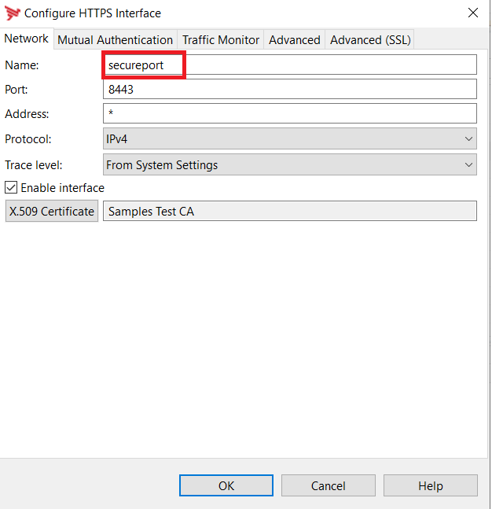

Though V7 gateway supports environmentalization through Configuration Studio and envSettings.props, it does not solve most of the customer problems, for example

- Same docker container can't be used across the environments
Currently, we are building a separate container for Dev, QA, PreProd and Prod using pol and env package or fed and envSettings.props.
- Can't leverage Kubernetes configmap or secrets:

Gitlab project https://git-ext.ecd.axway.com/cso-reusable/api-management/apim-components/apim-password-cert-env  is trying to solve the issue.

The project uses API Gateway's LoadableModule to override the passwords and certificates.  Other environment variables should reference the Operating System environment variable / configMap with prefix "environment".

- Database connection URL is environmentalized with environment variable db_url


- Password and certificate environment variable should follow a structure

    e.g export db_axway=xyz123

- The prefix "db" refers to database connection  - the prefix used by LoadableModule to update the appropriate entity.
- The suffix "axway" refers to a Database connection in Policystudio.
- xyz123 is a password of axway database connection.


##What is tested?

- DB Password:
```bash
$export db_axway=xyz123
```

- LDAP password
```bash
$export ldap_axway=changme
```
- SMTP password
```bash
$export smtp_manager=changme
```
- HTTP Basic
```bash
$export httpbasic_backend=changme
```

- x509 Cert - to trust the backend root and intermediate certificate. In order to use this feature, the connect to URL filter should be enabled with "trust all Certificates in the certificate store"


```bash
$export cert_domainroot="-----BEGIN CERTIFICATE-----
MIICxDCCAaygAwIBAgIGAW5HwjW7MA0GCSqGSIb3DQEBCwUAMBExDzANBgNVBAMM
BkRvbWFpbjAgFw0xOTEwMzEyMTI1NDBaGA8yMTE5MTAxNDIxMjU0MFowETEPMA0G
A1UEAwwGRG9tYWluMIIBIjANBgkqhkiG9w0BAQEFAAOCAQ8AMIIBCgKCAQEAlX2n
ePJaDMGWpNUwgyCfyDVIMjLKRjvJ7bID+BF+LI9gxJ2mUVFXl822fT3m2BR5oG8s
N/8JgvM+ie2PHxAWYokQcRSwYAFmMMMKp69M8sqAJHrm/QoVvFwCFVm+7DqJVKWu
q5K+J+ophJQNhvSl0KLorFI8IodLZq5cDtyhfaB27Zbk1A9ha4PfXmnoFWbDwoZU
UanoUy3xisbZ6HTvGKkawn53XaRJo5rn13b/9Np8PCJZLNmAiWoIB3NVyetwxS5C
4FwIm2ZRJZny5l+CgJ9Frs9Y0teAz4Z1bqJWn+kfBCxGW8Ab7W7t6ah3a/WoQxi2
HDU/134lBvoPhh9udwIDAQABoyAwHjAPBgNVHRMECDAGAQH/AgEAMAsGA1UdDwQE
AwICvDANBgkqhkiG9w0BAQsFAAOCAQEAlEo5pn1j8spkVg3RbLap80iwo8Slk+Fw
v8tGqR+GJEiJXDgnPPDMkrE+wtC1kT4VxyQw8D0eittUPjFmoMdxoUwM5Ddf4qS7
3LBO74CULyFZ0teyJoaVBjaG6MTg0ZfwUZt552IVLBgjbbE/yYu/dOJckpZlcZE7
yRw3ffr/trqh2B5tzwJMnWsakRwAtooRJ2RZ8ufQUhEYdI/7KJajZDQ0IFxleyPZ
PLHu3INlHcXQs3AY0wNBLhL2jBwZ0uwBYK+entFpCgb+Z+RQ+uxs3joYuKEMj6M6
6Xi8yAoGAN92VRi93iss3A7zoAsrPXCO7pNZdz3QzJ3Jjv9KW48DmQ==
-----END CERTIFICATE-----"
```
- PKCS12 - To update the https listener certificate.  There are two environment variables used to setup certificate on Listener interface
  
  -- certandkey_secureport
  
  -- certandkeypassword

```bash
export certandkey_secureport="MIIL5gIBAzCCC7AGCSqGSIb3DQEHAaCCC6EEggudMIILmTCCBi8GCSqGSIb3DQEHBqCCBiAwggYcAgEAMIIGFQYJKoZIhvcNAQcBMBwGCiqGSIb3DQEMAQYwDgQI9bSw5/Kr0SsCAggAgIIF6DTG3vfPtoc4NPgJE9FU43PRyMpBcv/JIefNDTvC5CNQ+7b47Afqo6mJFIndSxTEbHcnWNG/ufC2/C+7oTn8aZyrgi868fgysv9knhOe+tPJ1O6RyF690m00CmoRhE4kCDKMPaAeRR2ZAMAqj9nPrxjWMXKdrS8+LeEhq2SYSozP8VR+llaTrDPtO8+mC9KRfJIgrKpbB0G/qdnJNtrhJJ8fhaE+/Ufkhydwe0tldu+kOGMODCWVpCY5q2MRrQlhvQhLOYJ7LA/Ovz1ZDjOAE9oujqvhegDxwHj4I6sxHYhGsPUYstNiiqpI5ZcODxUajd5JmEGytk9LU/9PtKEQrXMB4/H7RsRV2bVMWtDaHVW5g0h0oUTw5SBJuPEZMljfLSIXiazerlDC5wybVKVoImDcSiYqHzEKj4DivSclrNfFk4JMMaKIphZZ2qBkCEZ0hEyGxwixyE09yexzW6/5Aq/LF51NJ8THjVHFFScDyOdNsAjiNugXFKe9OkuXW130bbLO+iGscWeJ6vGzjQRM9XIcAOiGJf0jwrGmTu+lFu70C4w+ka5oe6smcABsi52NbeZ7ylW74Fd+fU/O18nXoa7kTbzW5V/BaN+r5flxh1Xd2tUfvG00ABcWtDfHGXSuAtPp+LKRvgU0zS9BVMEr/ZpBpT3KbZAfGjk7Ies/ICpu1OKIDmLrrXHS6ZFhr7+frSjUrmrqGW4+eRBpLQDWD1/XNVzRkbfyE6Lv/lMBjc5BAEG3ZVRSpg9FemyYe5mVk1ehOMdQvUqEGd7DkmfMyXgpUVAbOqebhkS2PSRfcwZZ8O+LQOAnrWI4PRsO0XhmKpmith7S4F+IZ+xKVtkDJbNjAW63OVXKK1E914n7DuI07YCn3CGC4V4i3QlGUgY6kHoEIEfYroCGwupkSh2VLdtsru0dhoP8Dzo0AteWt7knjSQ+era/aPy3qSDE6uUbFNEHD+ol7iD5JMPGG1vnmlCu3nedwkH66LI4Zh8JSQ8qfNwSPt6GVScmpu6HmyuEH1gx6C98bvdzQMcsE+VmjldgGOIobIsTFFmcQMHEM/12R5A/VtnVEQHUY6giuFJpA7IZ2fKHtUiH0ijq1gntkUwWiJml/rb9DQHeZloKpYTEs7GuFdi8CNBZ/vThUcFPVlu8XslPm1zQZlXLb4/ian2Mdu78/FIWz7VVVSpJOablgltcIzOR2QdVYv/rmJsqecAnn2g1f+c5RvLMv2XfyJUzyfW/krlwswDiySV788BsSDylAAthUzs0RjOSIkRnaBGhYEEwhgcHOZV3l5xBjbde+0mR2hiZ3XdfQN9ZITHeCrkSv6yTtH3zh4X6YiPnY0BptOvAV/Vk/Ktdio5rSg8zjC8EDGun1p8vt/eYiIu6YEmeLxwrH27SJSgpnRkpN+u23Mq0zRrQevc7VEej0q1l4XrTDJcCTJhr5swT1UUnJ57tnKnz5X3rqrq9UrTzohVFR445PJFxHbrzyAq9og4OOU3Ya4NHcJmm0+st/V2kBs65oAGNItDJGBGyObXSKMJb4yFc6lf7EneHRMDnLTlz8XES/AN1KVih3TMfjUfgfcXFVLWKRoPVuQP0uNIPto9AIasnrxIc2zhcFpebbnUIAVRUBvNfbkHOGnjYTPf1iXs1uyDRmnQxWXbFpsBQ77wGkXrEHACbCg6pBoe9Lw2A0N5LWQniZy5dire24ZczJRKnk1W6T5W7khIqQ0h1leHsDS+bRSjaKt7MmPbp50MhoK/pX7M0Y2oO7p7Y3lQDtJ2VblMtwe7xWDbHMXDtpKQmcJg1rb5Q/2RZ3VUm08sEH3thughjogoXqCXOXn/FaJ7lVGA3qdjGgaZi1JLXd8NozwEcuNvSy/517a4Ek/uRXKVzV8WsdW8JZGvyELvlbIrdk5evNLc8W7nG4Q4BGSvEAhdLqLkpfBxgER+SU/ojSTa2wm8r/bKK5q8SVxvxaFYEAhJJyf3BrRNm9PokzDWlRR08teSkL2WKIWVX1Bw0Wo1F78Ee7DCCBWIGCSqGSIb3DQEHAaCCBVMEggVPMIIFSzCCBUcGCyqGSIb3DQEMCgECoIIE7jCCBOowHAYKKoZIhvcNAQwBAzAOBAg6h0uS8i8h6AICCAAEggTIpKit9ZymYjEoIoMkUpAq44lSCclY8qSmRhoaWnDNTQLhy37fxMf0hiJZ2krvBzGhNLQyBB2Yrob9lry0Sv24mkOUjRxCAhpDu03EThSC/cebaKN0+W1g4qR3EG5zLDtljI+7tgDBhE/PWuV12ZgoP3t9+JHCo1/OVv/IPtUuiP+EVk+SKW9x9/u/HKaordRi4WMhEVW8pUdMktRSQjSzupDE+8GV2ykaZ5BSfbk4RsZD2dyl5hW9lLQ9xFV786667MQcsDh4DhObWQZtX/bASw0/XS6L+TdJmxSOyIci/RGg5iyLxx7xcWRP6zfIiwacrYMxnEB7GX1QDiS3AdjeFoua+htX1DlP7Om15w/b8q79dLhMw+eSUn8g/aLp9n0PKs5mxn6rMcCrmOZJQq5y+0u7g6zOarKx08d6w7yDNCnDS7Hu2DqwaxhHyToEFjQtCw3e7ALdyB/QsZ5HpNNJjyoS+OYbAUJFU5i/oPSX3714wU/gwx/ZiVt4yWW808b8T8ksAKWhp4Gce+VipuNIXKKMdKgx7GiFK12ev31x5BHw+zSUXGc5TXXy0Nb51PTlFwF9/RBXEEleIq0914cK9UumJ6EpdfX6ssqwS9ASFhXfidAlhwH2fuw9lanFB8Y8IDnvBYCxxxtWymh7RZyBumBIdopRA8D2X51BuX6XeYVCYP7PJtXObQfLvGkY50SNOmHbCexq77UxezbMQES+mKW8YXLtZlsD1poOSmrkmRy+jvMXrHFAQidsI5Z2hZjo2sMZSPe+NAwM84yLJYoAq6LuDyhtk3WEbQNO+GB/KqFBOY3fcX0lHFdYEIovTBW+BhspdYEPvJJ01uzgG2VhvriqJ3/ETinKmMvgf5UpJDY+DJ6tgqprN3YCtPB9+NR4cmNz/OUoZKARy64UPWJuX6APGPFIAOD0gNgHqYcrpuksprX/YiYsBVOv/ouqJ9MG36EZ2WYG/KsdtCTssfHYAll5WFu1pGVKVtQJE7sN3Y34jSJDF2F2UoxQbg2CmEnM57GK7kcPjiPnCKPj+o+SEnC8BIO1TxoYnMUB87zfuO53qAdLdQkBvg2salAUsBEHmrDyIOGnEXBuAhHSHbSZSnGpD8gbhnOqfHkRu/OT5BVvnJE+w+dfTlh9vB777VbA5aEYSN16HucPkj3BelDU9+1GctZsSNg4fV/rla7RMf0SUZ02rVbX+52UwxUvuaDH+Pe+QvkTy6sc4b9IIXTphXoZWGClWBGOLBpHfMyxzu2IX4jE4M26DIwUZnVd0vkMYh8dZywgjBCoAJji6Oc1QiNzI3hAwO2sRTaVX5pxZApR+JwPY9ZwLyaOpTSbOXOP7rNZNTMCs1OUHgQdrmPPkE5EBjD/VqXOfLks0Nc8fV1zhofKe088UTZ/qCZKQwK40qhjnYLZ2C1rYjgGtiGHMaPznmwuIazZV9pKgVw+TGTWQmnmuWq7XDEzorbxh0ExjG4S45IQUaTG2kZ9GuHMj3Ocpmf/cJhTZl7wro2x+p/opJYqdKbMOaA+8orsU5r9BCv7NZFh278fSo3fpPut9+ZpmSaYDPpDjAuYlpzv1NFTyAz8Q2myFWFHSxh+KnSfhrEtf4euDRgQ/9gZ2IqXUsZ3FXUNtymfMUYwHwYJKoZIhvcNAQkUMRIeEABDAE4APQBhAHgAdwBhAHkwIwYJKoZIhvcNAQkVMRYEFFnwiPQwNks1gKUHDM3ye/ArMTPaMC0wITAJBgUrDgMCGgUABBQMVJgNbDx/sDqV37rk+lgsiaWPhgQIXKMl/uHVEFw"
export certandkeypassword=changeit
```
**secureport** is the name of the https interface.



The PKCS12 file is base64 encoded, it will be changed to file ( reading from an external drive or ??)


##Yet to be tested:

- Radius  - yet to be tested
- Cassandra Certificate reference  - yet to be tested
e.g : cassandraCert_root="-----BEGIN CERTIFICATE-----
MIICxDCCAaygAwIBAgIGAW5HwjW7MA0GCSqGSIb3DQEBCwUAMBExDzANBgNVBAMM
BkRvbWFpbjAgFw0xOTEwMzEyMTI1NDBaGA8yMTE5MTAxNDIxMjU0MFowETEPMA0G
A1UEAwwGRG9tYWluMIIBIjANBgkqhkiG9w0BAQEFAAOCAQ8AMIIBCgKCAQEAlX2n
ePJaDMGWpNUwgyCfyDVIMjLKRjvJ7bID+BF+LI9gxJ2mUVFXl822fT3m2BR5oG8s
N/8JgvM+ie2PHxAWYokQcRSwYAFmMMMKp69M8sqAJHrm/QoVvFwCFVm+7DqJVKWu
q5K+J+ophJQNhvSl0KLorFI8IodLZq5cDtyhfaB27Zbk1A9ha4PfXmnoFWbDwoZU
UanoUy3xisbZ6HTvGKkawn53XaRJo5rn13b/9Np8PCJZLNmAiWoIB3NVyetwxS5C
4FwIm2ZRJZny5l+CgJ9Frs9Y0teAz4Z1bqJWn+kfBCxGW8Ab7W7t6ah3a/WoQxi2
HDU/134lBvoPhh9udwIDAQABoyAwHjAPBgNVHRMECDAGAQH/AgEAMAsGA1UdDwQE
AwICvDANBgkqhkiG9w0BAQsFAAOCAQEAlEo5pn1j8spkVg3RbLap80iwo8Slk+Fw
v8tGqR+GJEiJXDgnPPDMkrE+wtC1kT4VxyQw8D0eittUPjFmoMdxoUwM5Ddf4qS7
3LBO74CULyFZ0teyJoaVBjaG6MTg0ZfwUZt552IVLBgjbbE/yYu/dOJckpZlcZE7
yRw3ffr/trqh2B5tzwJMnWsakRwAtooRJ2RZ8ufQUhEYdI/7KJajZDQ0IFxleyPZ
PLHu3INlHcXQs3AY0wNBLhL2jBwZ0uwBYK+entFpCgb+Z+RQ+uxs3joYuKEMj6M6
6Xi8yAoGAN92VRi93iss3A7zoAsrPXCO7pNZdz3QzJ3Jjv9KW48DmQ==
-----END CERTIFICATE-----" 